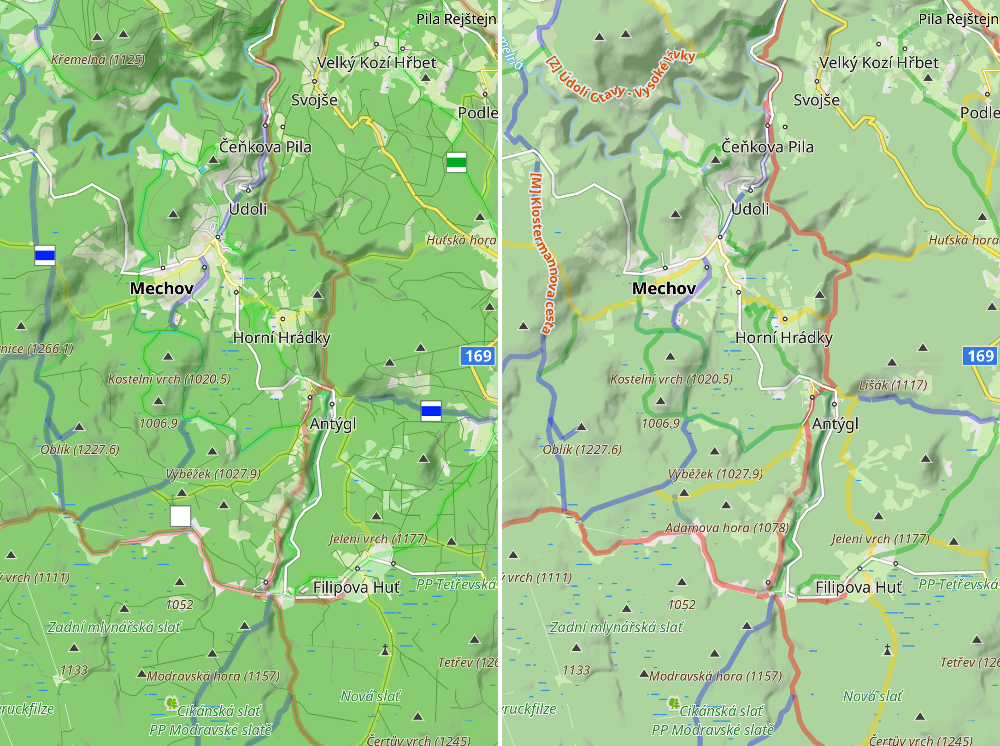
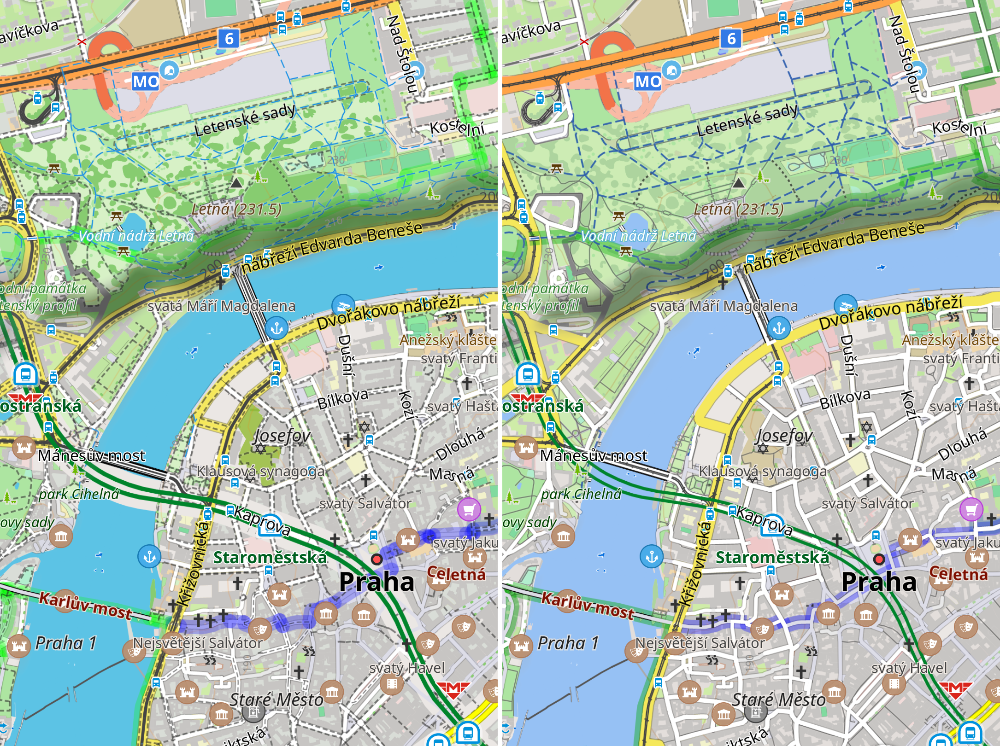

# ExplorerRS: custom OsmAnd rendering style

**Goal:** Create a multi-purpose [OsmAnd](https://osmand.net/) rendering style which would be practical to use both for outdoor activities and in the city.


## Features

- pastel colors of larger areas (forests,...) to let other objects stand out
- foot & cycle paths, tracks - improved styles (more visible, but hopefully not overwhelming)
    - rendered under roads, otherwise the map becomes cluttered with sidewalks etc. (zoom 14--16)
    - visibility with moreDetailed="true":
        - zoom <=12: nothing
        - zoom 13: tracks, cycleways
        - zoom >=14: all paths
- hiking (+fitness+running) routes - improved styles, more visible colors
    - rendered under roads&paths (layer-aware), option to switch back to default (*Details - Hiking routes rendered on top of roads/paths*)
    - no shield/icon on zoom 12, option to completely hide them (*Hide - Shields: ...*)
- mountain area, valley and water - improved texts
- railways (trains, trams...) - improved styles (more visible)
- subway - improved styles: more subtle, no service rails, option to switch back to default (*Details - Detailed subway*)
- aerialways (cable cars, lifts...) - improved styles (more visible)
- street names for residental/living_street - show from zoom 15
- buildings - show names from zoom 16, house numbers from zoom 18
- less visible:
    - smaller power tower icons
    - hide power=substation text (at least try to)


## Screenshots

Hiking routes overview:


Hiking routes, paths, cable car:


City streets, sidewalks, parks, cycleways:


City overview with subway:


## Installation

1) Download `ExplorerRS.render.xml` to your device
2) Import it into OsmAnd:
    - either by opening the file with OsmAnd from the file explorer
    - or in OsmAnd menu: *Maps & Resources - Local - Rendering styles - Three dots - Import*
3) Set the map style for the selected profile:
    - *Configure profile - Configure map - Map rendering - Map style: ExplorerRS*

### My settings recommendations:
- Profile appearance:
    - View angle: Rest & navigation position
- Configure map:
    - Show
        - Transport - Subway routes: on
    - Topography
        - Contour lines: on (Color scheme: brown / dark brown)
        - Terrain: hillshade
    - Routes
        - Hiking routes: on
    - Map rendering
        - **Map style: ExplorerRS**
        - Details - More Details: on (if desired)
        - Hide - Boundaries: on


## Developing

### First time setup

Setup [Waydroid](https://waydro.id/), install OsmAnd~ from F-Droid, setup OsmAnd: create `ExplorerRS` profile, set as default, optionally add developer widgets (zoom). You might want to switch the rendering engine to version 1, which has better performance, but remember the engines behave and render stuff slightly differently so what works for one might not work for the other!

To import the rendering for the first time:
```
sudo cp ExplorerRS.render.xml ~/.local/share/waydroid/data/media/0/Download/ExplorerRS.render.xml
```
In Waydroid, manually open the file and import it into OsmAnd.


### Apply new version

Overwrite rendering with a new version and kill the app:
```
sudo cp ExplorerRS.render.xml ~/.local/share/waydroid/data/media/0/Android/data/net.osmand.plus/files/rendering/ExplorerRS.render.xml  &&  sudo pkill -x net.osmand.plus
```
Then, simply open OsmAnd again.


## Credits

The ExplorerRS rendering style is mainly based on [UniMap](https://github.com/basings/OsmAnd-custom-map-styles/blob/main/UniMap.xml) and [routes.addon.render.xml](https://github.com/osmandapp/OsmAnd-resources/blob/master/rendering_styles/routes.addon.render.xml).

The style has been also inspired by other styles:
- [`osmandapp/OsmAnd-resources`](https://github.com/osmandapp/OsmAnd-resources/tree/master/rendering_styles):
    - `default.render.xml`
    - `Touring-view_(more-contrast-and-details).render.xml`
    - `routes.addon.render.xml`
    - `topo.render.xml`
- [`basings/OsmAnd-custom-map-styles`](https://github.com/basings/OsmAnd-custom-map-styles)
    - `UniMap.xml`
- [`OsmAnd-Rendering`](https://github.com/OsmAnd-Rendering)
    - `Hiking.render.xml`
- [`TuristCZ.render.xml`](https://osmand.cz/blog/vykreslovac-turistcz-v-4)
- [`eml.render.xml`](https://pastebin.com/7MystwDv)
- [OpenStreetMap Carto](https://wiki.openstreetmap.org/wiki/OpenStreetMap_Carto)
- [mapy.com](https://mapy.com)
